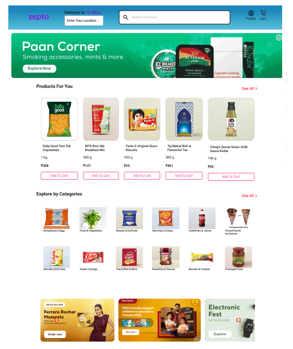
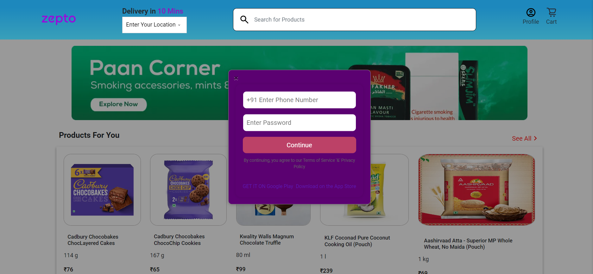
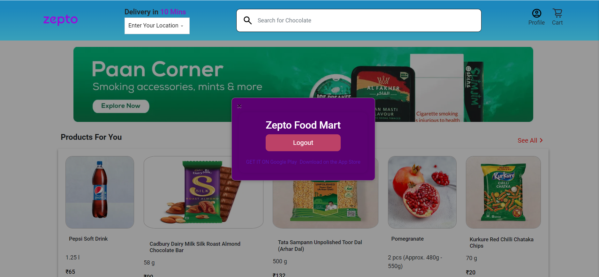
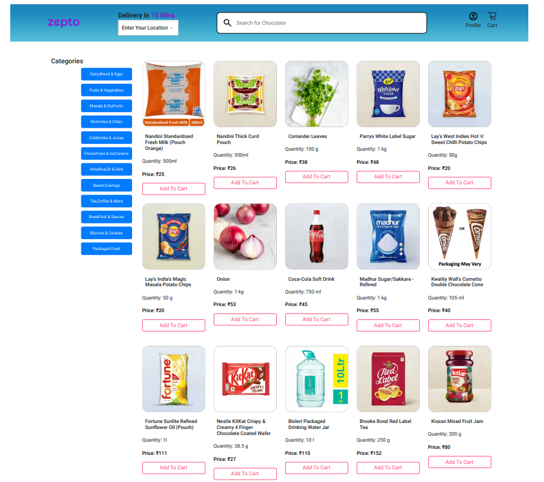
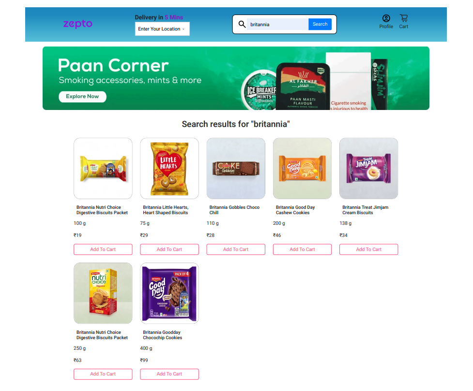
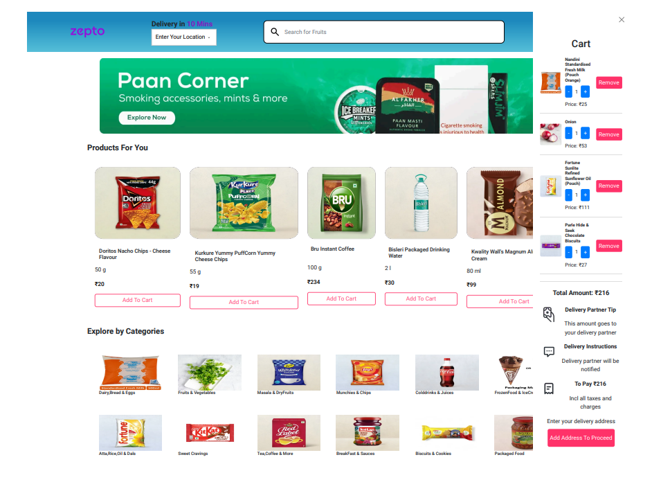

# Alibaba-Aces_110


## Zepto: Online Grocery Delivery
Welcome to Zepto, an innovative online grocery delivery platform designed for individuals aged 18 and above. Our mission is to redefine convenience by delivering groceries to your doorstep within 10 minutes. Whether you need an urgent grocery item or prefer avoiding the hassle of market visits, Zepto is your go-to solution. Our extensive range of products ensures that all your daily needs are met promptly and efficiently. Experience the future of grocery shopping with Zepto, where speed and reliability come together to offer unparalleled service. Your time is valuable, and we're here to save it.

## Project Type
Fullstack

## Deplolyed App
Netlify: https://zepto-website-unit-4-project.netlify.app/     <br>
JSON-Server: https://mock-server-api-wh0v.onrender.com/

## Directory Structure
Alibaba-Aces_110/

├─ backend        
│  └─JSON Server<br>
├─ frontend        
│  ├─ index.html     
│  ├─ style.css          
│  ├─ js            
│  └─ assets          
└─ README.md


## Contributors

- [Rahul George](https://github.com/RahulGeorge96) (Team Lead)
- [Abhishek Mishra](https://github.com/abhishek3042)
- [Mukul Kudegave](https://github.com/Mukul-kudegave)
- [Sanpreet Singh](https://github.com/Sanpreet0415)
## Video Walkthrough of the project
-[ Project Presentation](https://www.youtube.com/watch?v=jfTEX7J5ZHw) 

## Questionnaires related to project

-[ Video 1](https://www.youtube.com/watch?v=uSRsret_Vyc) 

-[ Video 2](https://www.youtube.com/watch?v=ywf0rfj_f7w)
## Features
- **Login and Logout** : Securely access and manage your account and cart.
- **Search** : Quickly find products with keywords.
- **Location Tab** : Set delivery location for accurate service and availability.
- **Cart** : Manage selected items, quantities, and checkout process.
- **Filtering** : Refine searches by categories and subcategories for easier navigation.


## Installation & Getting started
1. Clone the repository in your system.
2. Open the folder in vscode and install npm
    ```bash
    cd Alibaba-Aces_110
    npm install
    ```
3. Open index.html to live server.
4. Explore the website and features.


**Landing page** <br>


**Login page** <br>



**Categories page** <br>


**Search page** <br>


**Cart**  <br>


## APIs Used
- JSON server: https://mock-server-api-wh0v.onrender.com/ <br>
- Google Map Places API

## API Endpoints
GET /api/products - retrieve all products <br>
GET /api/user - access a user


## Technology Stack
- HTML
- CSS
- Javascript
- Bootstrap